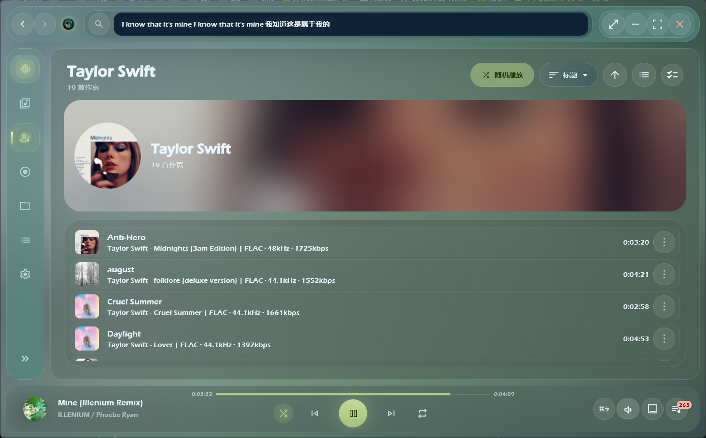
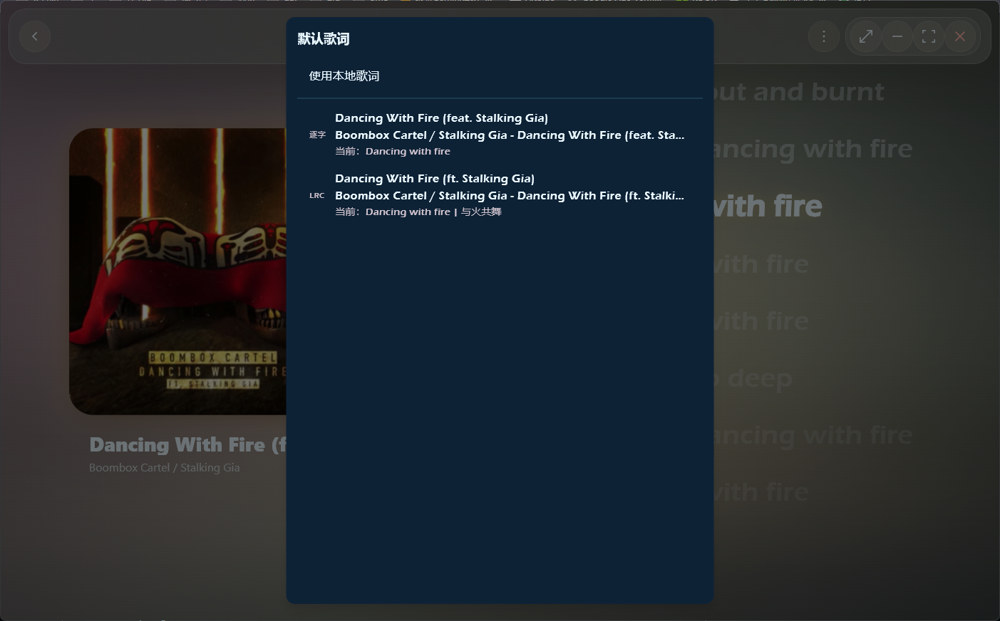

# 🎵 栖声 Qisheng Player

<div align="center">
  
</div>

<div align="center">
  <strong>一款专为 Windows 10/11 打造的现代化、高颜值本地音乐播放器</strong>
</div>
<br>

<div align="center">

[](https://github.com/reneryi/coriander_player/actions/workflows/windows_ci.yml)
[](https://www.gnu.org/licenses/gpl-3.0)
[](https://flutter.dev)
[](https://www.rust-lang.org/)

</div>

栖声 (Qisheng Player) 是一款基于 **Flutter**、**Rust** 与 **BASS** 音频库构建的高颜值本地音乐播放器。本项目是对上游优秀开源项目 [Ferry-200/coriander_player](https://github.com/Ferry-200/coriander_player) 进行的二次开发与全面升级。经过深度的重构与优化，当前版本 (`v1.0.0`) 带来了极其现代化的 **玻璃拟态 (Glassmorphism)** 界面、丝滑的动画过渡效果、以及更强大的本地曲库管理功能。

---

## ✨ 核心亮点与特性 (Features)

我们对 UI 进行了全面翻新，引入了 Apple Music 风格的设计理念，并深入底层重构了多项核心功能。

### 🎨 现代化的视觉与交互设计
- **全局玻璃拟态 UI**：全应用统一的毛玻璃视觉风格，背景具备随专辑封面主色调动态变化的流体弥散光效果。
- **极致的沉浸体验**：提供专属的“沉浸式 / 专业 Now Playing”页面，配合逐字歌词动效，带来绝佳的视听享受。
- **平滑动效与过渡**：页面间的 shared-axis 转场、专辑封面的 Hero 共享元素动画，让每一次点击都丝滑流畅。

<p align="center">
  
  
</p>

### 🎶 极致的本地曲库管理
- **海量音乐秒级加载**：依托 Rust 编写的高效底层，支持多文件夹扫描与智能索引缓存，告别卡顿。
- **多维度浏览与定位**：内置 A-Z / 拼音索引，支持全局搜索、多选操作，以及按添加时间、艺术家、专辑等多维度排序。
- **丰富的元数据编辑**：支持右键快速编辑 ID3 标签、封面（支持从文件选取或内置图库挑选）和内嵌歌词。

<p align="center">
  
  
</p>

### 🎧 专业级音频与播放队列
- **全格式兼容**：完美支持 MP3, FLAC, WAV, APE, OGG, AAC, OPUS, DSD 等主流与无损格式。
- **高级音频控制**：支持 ReplayGain 音量均衡、CUE 分轨读取，并提供强大的 **专业均衡器 (EQ)** 供发烧友细调听感。
- **灵活的队列管理**：支持单曲循环、列表循环、随机播放，可自由拖拽重排，并提供精细的播放次数与习惯统计。

<p align="center">
  
  
</p>

### 📝 完善的歌单与歌词系统
- **动态逐字歌词**：支持本地歌词（LRC/UTF-8/UTF-16）、在线匹配获取，并提供带有发光特效的逐字动效与外语翻译切换。
- **多端同步显示**：内置桌面悬浮歌词以及右侧侧边栏的歌词预览功能。
- **灵活的歌单管理**：支持创建自定义歌单，并提供直观的歌单编辑与封面选择功能。

<p align="center">
  
  
</p>
<p align="center">
  
</p>

### ⚙️ 深度系统集成
- **全局快捷键**：支持自定义应用内与全局后台快捷键（支持媒体键响应）。
- **硬件适配**：支持鼠标侧键控制、系统托盘（System Tray）、任务栏缩略图控制（Thumbnail Toolbar）、窗口自由拖拽与缩放。

---

## 📂 支持格式详细列表

| 格式分类 | 支持格式 | 播放支持 | 内嵌歌词读取 |
| --- | --- | :---: | :---: |
| **常见格式** | MP3 / MP2 / MP1 | ✅ 支持 | ✅ 支持 |
| **无损音频** | FLAC / WAV / WAVE | ✅ 支持 | ✅ 支持 |
| **其他主流** | OGG / AAC / ADTS / M4A / OPUS | ✅ 支持 | ✅ 支持 |
| **苹果格式** | AIFF / AIF / AIFC | ✅ 支持 | ✅ 支持 |
| **高阶/特殊** | APE / WV / WVC | ✅ 支持 | ⚠️ 视标签而定 |
| **更多格式** | DSD / AC3 / WMA / MPC / MIDI / AMR / 3GA / DTS | ✅ 支持 | ⚠️ 视标签而定 |

*注：同目录的 `.lrc` 文件、TXT 歌词文件以及在线歌词匹配功能可作为内嵌歌词的有效补充。*

## ⌨️ 默认快捷键 (Shortcuts)

| 动作分类 | 功能 | 快捷键 |
| --- | --- | --- |
| **播放控制** | 播放 / 暂停 | `Space` (空格键) |
| | 上一首 / 下一首 | `Left` / `Right` (左右方向键) |
| **音量控制** | 音量加 / 音量减 | `Up` / `Down` (上下方向键) |
| | 静音开关 | `Alt + M` |
| **界面交互** | 显示 / 隐藏桌面歌词 | `Ctrl + M` |
| | 显示 / 隐藏主界面 | `Ctrl + H` |
| | 返回上一页 | `Esc` |
| | 退出程序 | `Ctrl + Q` |

> 💡 **提示**: 所有快捷键均可在「设置」中自由修改，部分操作支持后台全局响应。

## 🛠️ 项目结构

```text
qisheng_player/
├─ lib/                         Flutter 主程序、页面、组件、主题和服务
│  ├─ component/                 通用组件与播放器 UI
│  ├─ library/                   曲库、歌单、封面、播放次数和元数据
│  ├─ page/                      音乐、艺术家、专辑、文件夹、歌单、设置等页面
│  ├─ play_service/              播放、歌词与桌面歌词服务
│  └─ src/bass/                  BASS 播放桥接
├─ rust/                         Rust 元数据读取与原生能力
├─ rust_builder/                 flutter_rust_bridge 生成/桥接包
├─ windows/                      Windows Runner、资源和窗口集成
├─ third_party/desktop_lyric/    桌面歌词子程序
├─ test/                         Widget、服务和回归测试
├─ tools/release/                Windows 发布打包脚本
├─ docs/                         更新日志、结构说明和发布流程
├─ assets/                       栖声品牌图标资源
└─ BASS/                         本地运行依赖 DLL，不提交到 Git
```

更详细的目录说明见 [docs/project_structure.md](docs/project_structure.md)。

## 🚀 本地开发指南

```powershell
flutter pub get
flutter analyze
flutter test

Set-Location rust
cargo check
Set-Location ..

flutter build windows --debug
```

## 📦 Windows 发布打包

先构建主程序和桌面歌词：

```powershell
flutter build windows --release

Set-Location third_party\desktop_lyric
flutter pub get
flutter build windows --release
Set-Location ..\..
```

再生成发布包：

```powershell
powershell -ExecutionPolicy Bypass -File tools/release/package_release_windows.ps1 -Version 1.0.0
```

发布产物输出到 `dist/windows/artifacts/packages/`：
- `Qisheng-Player-v1.0.0-Windows-x64.zip`
- `Qisheng-Player-v1.0.0-Setup-x64.exe` (生成安装器需要本机安装 Inno Setup 6)

完整流程见 [docs/release_workflow.md](docs/release_workflow.md)。

## 📖 文档与变更记录

- [**更新日志与历史变更 (Changelog)**](docs/changelog.md) —— 查看当前版本与历史版本的详细更新内容。
- [项目结构](docs/project_structure.md)
- [Windows 发布流程](docs/release_workflow.md)
- [贡献指南](CONTRIBUTING.md)

## 📄 License

本项目基于 GPL-3.0 许可证发布。请同时遵守 BASS 与相关第三方依赖的授权要求。
