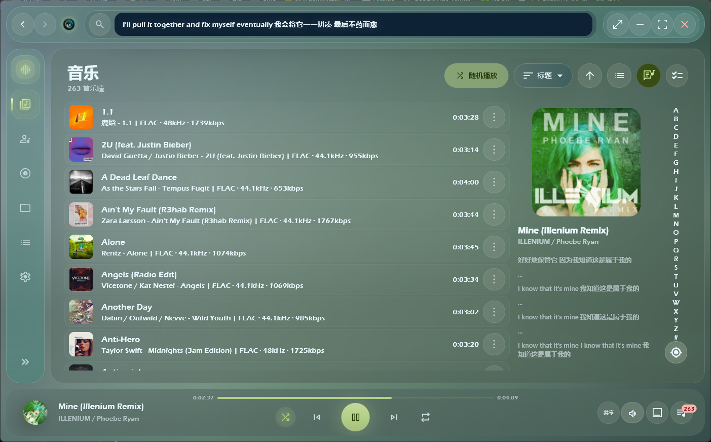
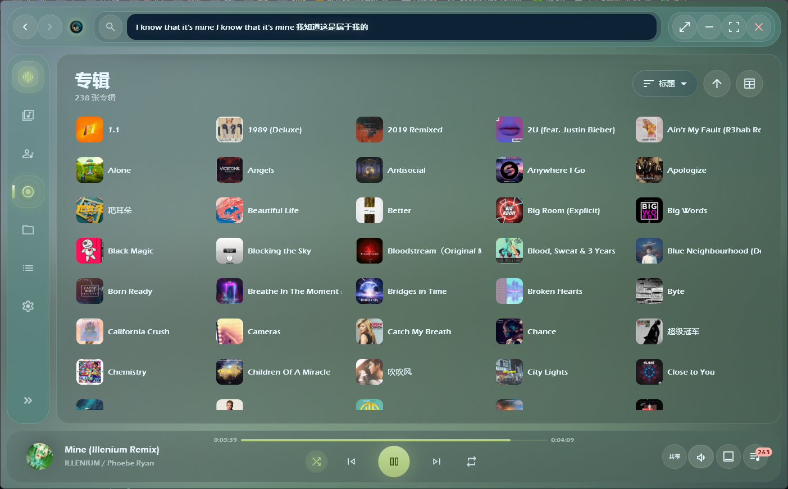
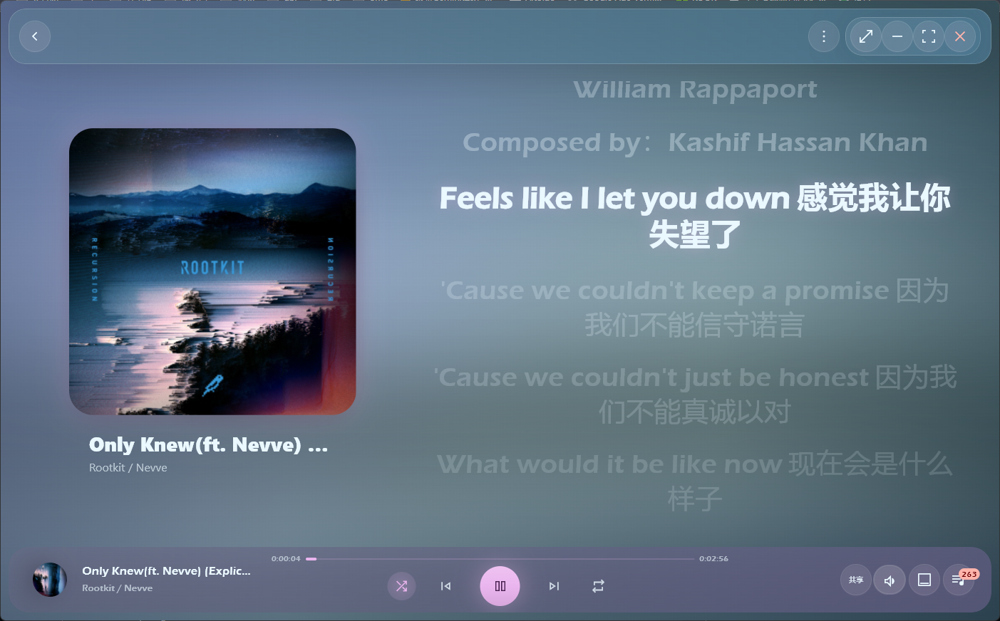
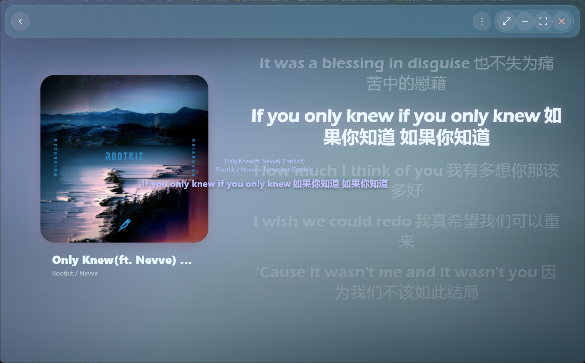
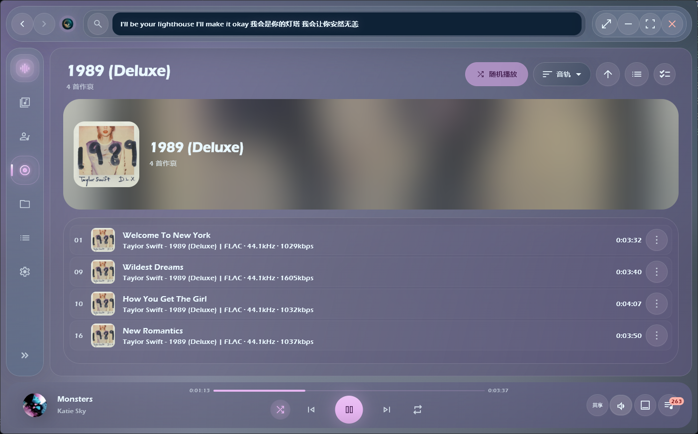
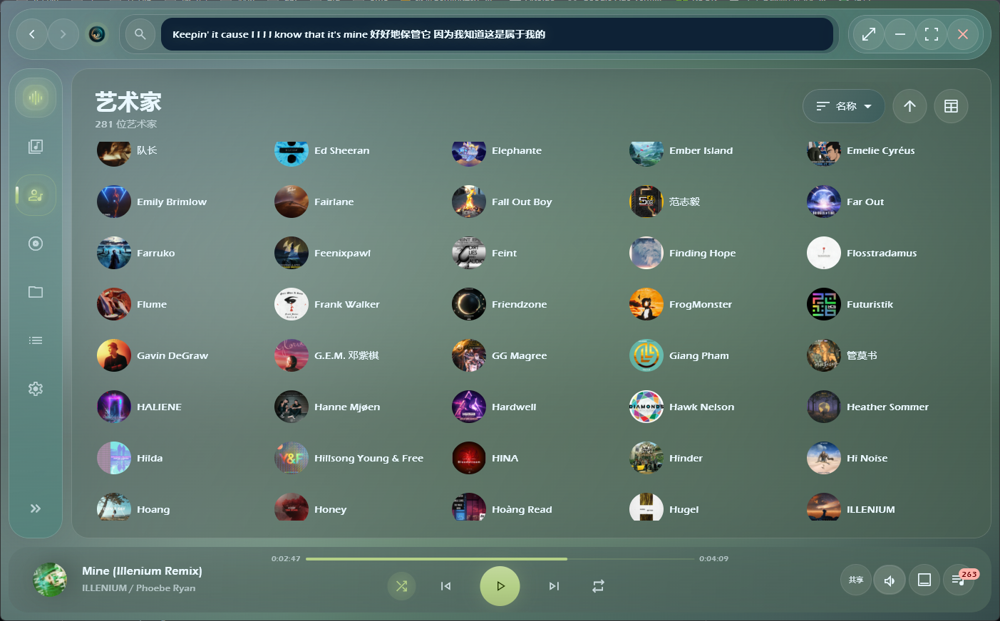
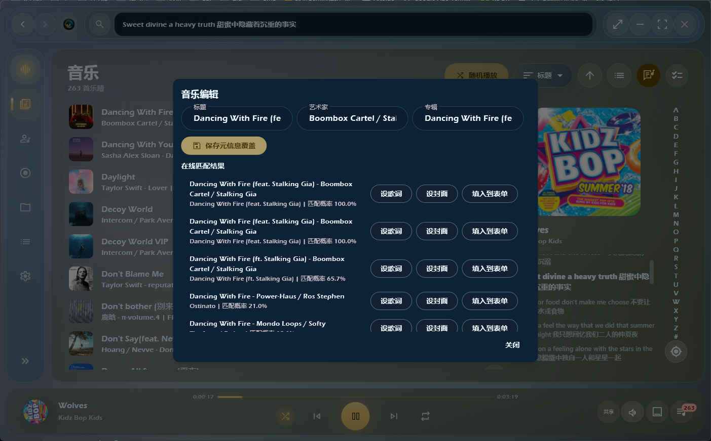

# 🎵 栖声 Qisheng Player

<div align="center">
  
</div>

<div align="center">
  <strong>一款专为 Windows 10/11 打造的现代化、高颜值本地音乐播放器</strong>
</div>
<br>

<div align="center">

[](https://github.com/reneryi/coriander_player/actions/workflows/windows_ci.yml)
[](https://www.gnu.org/licenses/gpl-3.0)
[](https://flutter.dev)
[](https://www.rust-lang.org/)

</div>

栖声 (Qisheng Player) 是一款基于 **Flutter**、**Rust** 与 **BASS** 音频库构建的本地音乐播放器。本项目是对上游优秀的开源项目 [Ferry-200/coriander_player](https://github.com/Ferry-200/coriander_player) 进行的二次开发。

我们的核心目标是**打造一款更好看、更好用、更精致的本地播放器**。在原版项目强大的文件扫描与播放能力基础上，当前版本重构了全局的视觉界面、精修了交互动效，并着重修复了大量的中文/日韩文标签乱码问题。

---

## ✨ 核心特性与亮点

### 🎨 视觉与交互焕新
- **玻璃拟态 UI (Glassmorphism)**：全应用统一的毛玻璃半透明视觉风格，主背景会跟随当前播放专辑的主色调缓慢流转。
- **顺滑的转场体验**：加入了页面间的平滑淡入淡出（shared-axis）过渡，以及专辑封面被点击时的 Hero 共享元素动画，让每一次操作更跟手。
- **精心优化的布局**：侧边栏改为悬浮胶囊形态，重新排布了底部播放控制区的控件，让操作逻辑更直观。

<p align="center">
  
  
</p>

### 🎧 沉浸式播放体验
- **Now Playing 页面**：提供沉浸式/专业式正在播放视图，支持平滑的竖向歌词滚动，当前播放行提供清晰的高亮显示。
- **多端歌词显示**：不仅支持独立的桌面悬浮歌词，还在主界面的音乐页新增了可随时展开的右侧迷你歌词预览栏。

<p align="center">
  
  
</p>

### 🎶 强大的本地曲库管理
- **高效的扫描引擎**：依托 Rust 编写的高效底层，支持多文件夹扫描与智能索引缓存。
- **多维分类浏览**：内置 A-Z / 拼音索引，支持全局搜索，可按艺术家、专辑、文件夹或自定义排序进行浏览。
- **乱码修复与元数据编辑**：底层修复了常见的 UTF-8 / Latin-1 编码冲突，极大地改善了历史音乐文件的乱码现象；支持右键编辑音乐的 ID3 标签、封面图和内嵌歌词。

<p align="center">
  
  
</p>

<p align="center">
  
</p>

### ⚙️ 格式兼容与系统级集成
- **全格式兼容**：完美支持 MP3, FLAC, WAV, APE, OGG, AAC, OPUS, DSD 等主流与无损格式，并支持 CUE 分轨文件。
- **播放与队列管理**：支持 ReplayGain 音量均衡；支持单曲循环、列表循环、随机播放等模式，队列支持自由拖拽重排。
- **全局融合**：支持自定义应用内与全局快捷键（响应媒体键），支持鼠标侧键、系统托盘及任务栏缩略图控制。

---

## 📂 支持格式详细列表

| 格式分类 | 支持格式 | 播放支持 | 内嵌歌词读取 |
| --- | --- | :---: | :---: |
| **常见格式** | MP3 / MP2 / MP1 | ✅ 支持 | ✅ 支持 |
| **无损音频** | FLAC / WAV / WAVE | ✅ 支持 | ✅ 支持 |
| **其他主流** | OGG / AAC / ADTS / M4A / OPUS | ✅ 支持 | ✅ 支持 |
| **苹果格式** | AIFF / AIF / AIFC | ✅ 支持 | ✅ 支持 |
| **高阶/特殊** | APE / WV / WVC | ✅ 支持 | ⚠️ 视标签而定 |
| **更多格式** | DSD / AC3 / WMA / MPC / MIDI / AMR / 3GA / DTS | ✅ 支持 | ⚠️ 视标签而定 |

*注：同目录的 `.lrc` 文件、TXT 歌词文件以及在线歌词匹配功能可作为内嵌歌词的有效补充。*

## ⌨️ 默认快捷键 (Shortcuts)

| 动作分类 | 功能 | 快捷键 |
| --- | --- | --- |
| **播放控制** | 播放 / 暂停 | `Space` (空格键) |
| | 上一首 / 下一首 | `Left` / `Right` (左右方向键) |
| **音量控制** | 音量加 / 音量减 | `Up` / `Down` (上下方向键) |
| | 静音开关 | `Alt + M` |
| **界面交互** | 显示 / 隐藏桌面歌词 | `Ctrl + M` |
| | 显示 / 隐藏主界面 | `Ctrl + H` |
| | 返回上一页 | `Esc` |
| | 退出程序 | `Ctrl + Q` |

> 💡 **提示**: 所有快捷键均可在「设置」中自由修改，部分操作支持后台全局响应。

## 🛠️ 项目结构

```text
qisheng_player/
├─ lib/                         Flutter 主程序、页面、组件、主题和服务
│  ├─ component/                 通用组件与播放器 UI
│  ├─ library/                   曲库、歌单、封面、播放次数和元数据
│  ├─ page/                      音乐、艺术家、专辑、文件夹、歌单、设置等页面
│  ├─ play_service/              播放、歌词与桌面歌词服务
│  └─ src/bass/                  BASS 播放桥接
├─ rust/                         Rust 元数据读取与原生能力
├─ rust_builder/                 flutter_rust_bridge 生成/桥接包
├─ windows/                      Windows Runner、资源和窗口集成
├─ third_party/desktop_lyric/    桌面歌词子程序
├─ test/                         Widget、服务和回归测试
├─ tools/release/                Windows 发布打包脚本
├─ docs/                         更新日志、结构说明和发布流程
├─ assets/                       栖声品牌图标资源
└─ BASS/                         本地运行依赖 DLL，不提交到 Git
```

更详细的目录说明见 [docs/project_structure.md](docs/project_structure.md)。

## 🚀 本地开发指南

```powershell
flutter pub get
flutter analyze
flutter test

Set-Location rust
cargo check
Set-Location ..

flutter build windows --debug
```

## 📦 Windows 发布打包

先构建主程序和桌面歌词：

```powershell
flutter build windows --release

Set-Location third_party\desktop_lyric
flutter pub get
flutter build windows --release
Set-Location ..\..
```

再生成发布包：

```powershell
powershell -ExecutionPolicy Bypass -File tools/release/package_release_windows.ps1 -Version 1.0.0
```

发布产物输出到 `dist/windows/artifacts/packages/`：
- `Qisheng-Player-v1.0.0-Windows-x64.zip`
- `Qisheng-Player-v1.0.0-Setup-x64.exe` (生成安装器需要本机安装 Inno Setup 6)

完整流程见 [docs/release_workflow.md](docs/release_workflow.md)。

## 📖 文档与变更记录

- [**更新日志与历史变更 (Changelog)**](docs/changelog.md) —— 查看当前版本与历史版本的详细更新内容。
- [项目结构](docs/project_structure.md)
- [Windows 发布流程](docs/release_workflow.md)
- [贡献指南](CONTRIBUTING.md)

## 📄 License

本项目基于 GPL-3.0 许可证发布。请同时遵守 BASS 与相关第三方依赖的授权要求。
