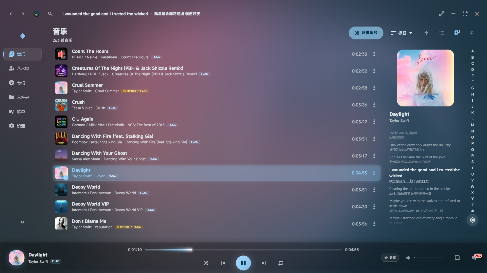
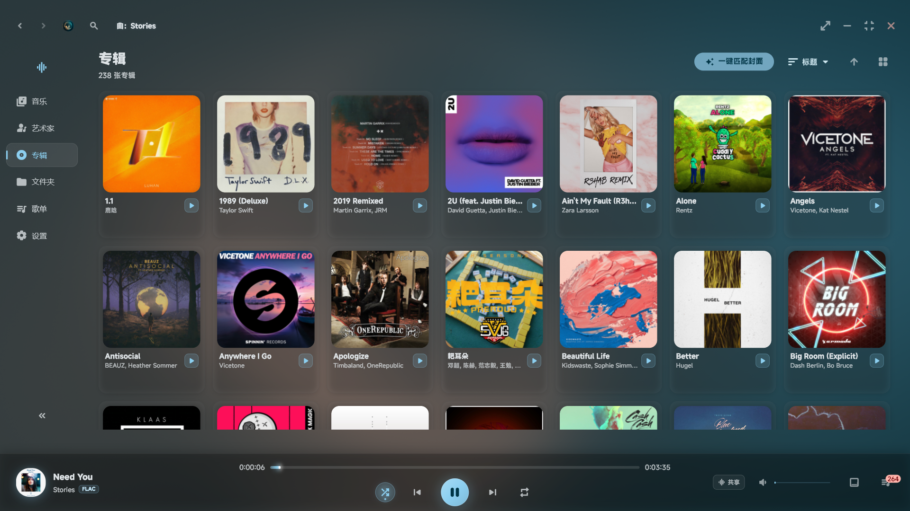
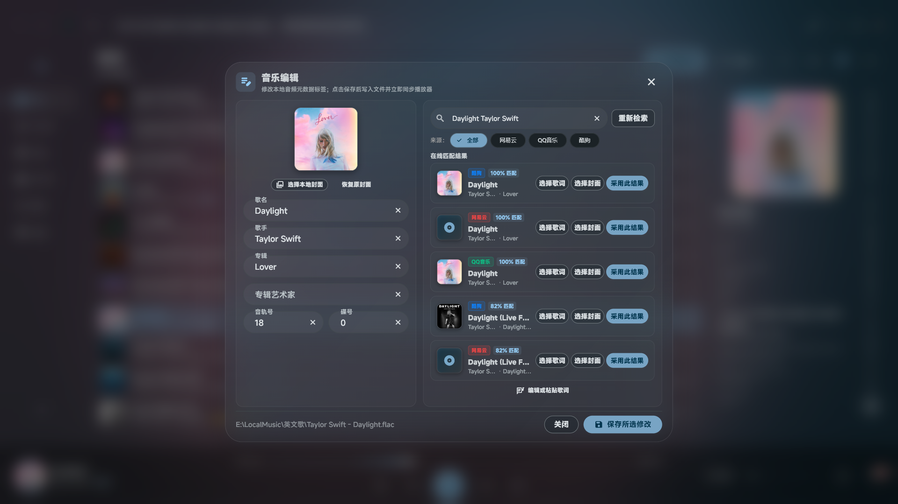
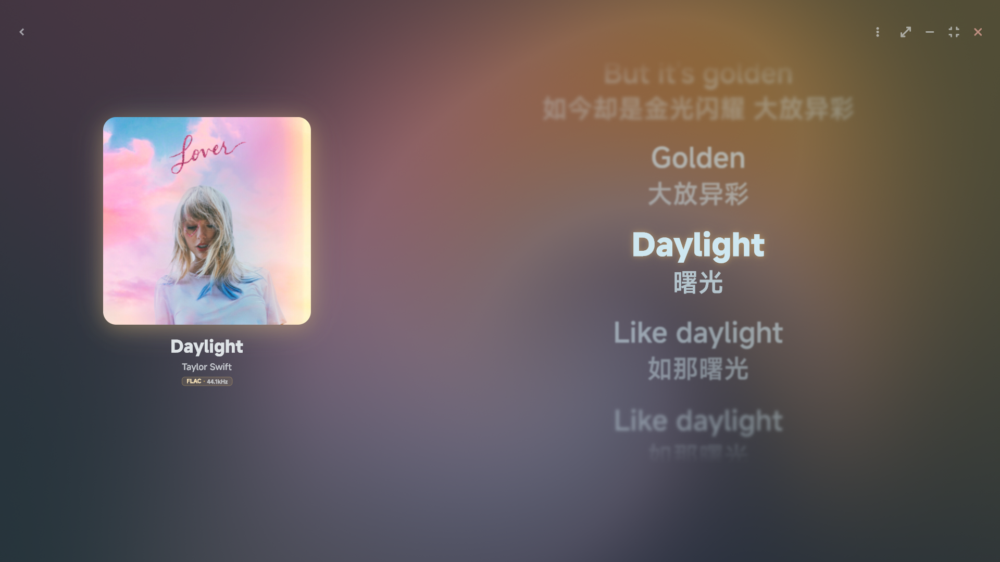
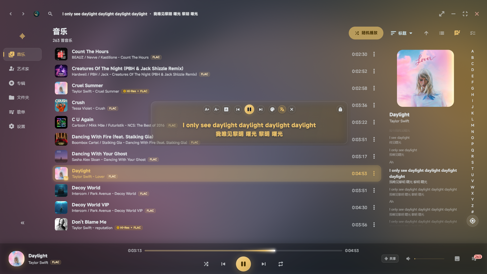
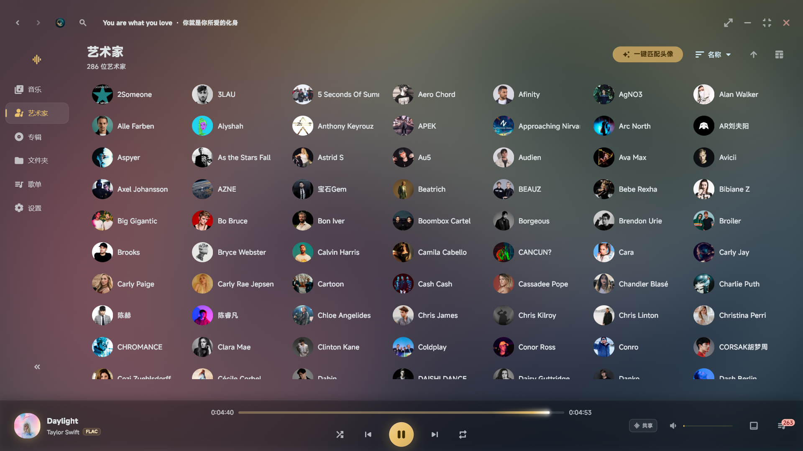
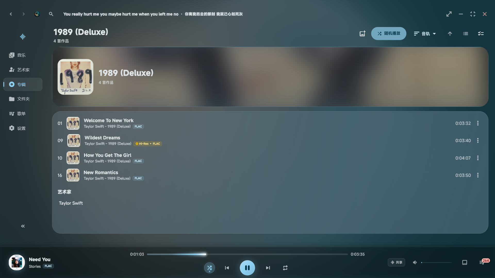

# 🎵 栖声 Qisheng Player

<div align="center">
  
  <h3><strong>一款专为 Windows 10/11 打造的现代化、高颜值本地音乐播放器</strong></h3>
  <p>基于 Flutter 3.x + Rust 原生引擎 + BASS 音频库构建，融合灵动微动量与现代光感材质</p>

[](https://github.com/reneryi/qisheng_player/releases/latest)
[](https://github.com/reneryi/qisheng_player/actions/workflows/windows_ci.yml)
[](https://github.com/reneryi/qisheng_player/releases)
[](LICENSE)
[](https://flutter.dev)
[](https://www.rust-lang.org/)

</div>

---

**栖声 (Qisheng Player)** 是一款专为 Windows 桌面生态深度定制的本地音乐播放器。本项目源于对上游优秀开源项目 [Ferry-200/coriander_player](https://github.com/Ferry-200/coriander_player) 的持续二次演进与重构。

我们的核心愿景是**打造极致视觉审美、丝滑微动量交互与硬核持久化能力的本地音乐体验**。在兼顾多格式高保真无损解码的同时，全面重构了现代化双栏音乐编辑工坊、圆润微动量控键系统、多重窗口背景材质与全局即时热同步管线。

---

## 📥 快速下载与安装

前往 [**GitHub Releases**](https://github.com/reneryi/qisheng_player/releases/latest) 页面获取最新安装包与便携包：

| 交付形式 | 文件名规则 | 说明 |
| :--- | :--- | :--- |
| **安装向导 (推荐)** | `Qisheng-Player-v<version>-Setup-x64.exe` | 现代化 Inno Setup 安装包，自动创建桌面快捷方式，支持一键卸载 |
| **绿色便携包** | `Qisheng-Player-v<version>-Windows-x64.zip` | 解压即用，无任何注册表依赖，适合放在移动存储介质随身携带 |

> 📌 **系统要求**：Windows 10 (1809 及以上) / Windows 11 (64 位处理器系统)。

---

## ✨ 核心特性与亮点

### 🎨 1. 极致光感材质与微动量物理交互
- **现代背景材质体系**：
  - **默认材质**：夜间采用 135° 深邃苍青微流光渐变，日间呈现温润柔和的和纸白质感。
  - **系统级融合**：原生支持 Windows 11 云母材质（Mica Alt / Tabbed Window）与实时亚克力（Acrylic）。
  - **动态视觉着色器**：集成片元着色器驱动的灵动弥散流光（Mesh Flow）与交互水波纹（Water Ripple）背景。
- **饱满圆润实心符号 (Rounded & Solid)**：全应用统一 Material Symbols Rounded 实心高权重视觉语言，拒绝干瘪粗糙。
- **双控制器物理微动量 (Kinetics)**：
  - `_pressController` 与 `_hoverController` 矩阵解耦合成，呈现丝滑自然的平滑插值弹性缩放与复位。
  - **方向微动量反馈**：上一首向左微冲量、下一首向右微冲量、随机播放触发 -90° 旋转势能、循环模式轻量上弹移与呼吸式微发光指示点。
- **核心播放控键无遮挡 (No-Tooltip Policy)**：底栏 5 个核心控键彻底移除浮动气泡，操作时杜绝遮挡曲名与进度条。

<!-- 屏幕截图展示区域 1：主界面与专辑展示 -->
<p align="center">
  
  
</p>

### 🛠️ 2. 全新现代双栏“音乐编辑”工坊体系
- **980px 双栏现代弹窗**：彻底废除单栏浅窄深滚与字段前置复选框设计，依托纯净网格表单与智能脏数据标记（`isDirty`）。
- **左栏：核心元数据与封面管理**：
  - 140x140 高清封面预览卡片，支持本地图片替换、一键清除与缩放预览。
  - 紧凑网格表单：标题、艺术家、专辑、专辑艺术家、音轨、碟号、年份、流派等一应俱全。
- **右栏：多源在线智能匹配与一键采纳**：
  - 网易云音乐、酷狗音乐、QQ 音乐多源并发检索，提供平台过滤 Chip。
  - 候选卡片直观呈现高分辨率封面、来源平台、匹配度得分与“★ 一键智能采纳”按钮。
  - 彻底解决 CDN 403 防盗链阻断与空 mid 404 伪链接问题。
  - **严格解耦视觉资产边界**：单曲内嵌封面、专辑全局画册与艺术家头像三者生命周期解耦，单曲采纳不再意外污染全局专辑。
- **实时歌词工坊**：支持在线歌词匹配预览、时间轴微调编辑、格式化导出与内嵌标签写入。
- **底层物理持久化与即时热同步**：
  - Rust 事务引擎加固：支持 MP3 (ID3v2)、FLAC (Vorbis Comment)、M4A/AAC (MP4 Ilst)、OGG 及 CUE 虚拟分轨物理写入。
  - Win32 Error 32（文件占用）指数退避自愈重试机制，保存成功后底栏、曲库与歌单视图即刻热刷新。

<!-- 屏幕截图展示区域 2：音乐编辑与详情 -->
<p align="center">
  
</p>

### 🎧 3. 沉浸式播放与全场景歌词体验
- **Now Playing 全景模式**：提供大屏居中沉浸式与紧凑双重布局，支持流畅平滑的垂直歌词逐行滚动与非聚焦景深模糊。
- **多端歌词自由呈现**：
  - **独立浮动桌面歌词**：支持置顶、穿透锁定、双行排版与文字微调；拥有全新独立配置子窗口，彻底根除启动闪白。
  - **主界面迷你歌词预览栏**：音乐库右侧随时一键展开收拢，边选歌边看词。
- **多样式播放进度轨**：支持标准进度条、紧凑纤细光轨与极光丝绸缎带呼吸光轨，适配不同审美偏好。

<!-- 屏幕截图展示区域 3：正在播放与桌面歌词 -->
<p align="center">
  
  
</p>

### 📚 4. 强大的本地曲库与智能管理
- **高性能底层索引**：基于 Rust 高并发文件扫描引擎，支持毫秒级多目录检索与持久化索引缓存。
- **多维浏览与拼音索引**：内置 A-Z 首字母与全中文拼音检索，支持按单曲、艺术家、专辑、文件夹分类过滤。
- **智能编码自愈**：底层自动检测并纠正历史音乐文件中常见的 UTF-8 / GBK / Big5 / Latin-1 标签乱码。

<!-- 屏幕截图展示区域 4：艺术家与专辑详情 -->
<p align="center">
  
  
</p>

---

## 📂 音频格式兼容矩阵

栖声依托成熟的 **BASS 原生音频架构**，提供出色的格式兼容性与硬解表现：

| 格式分类 | 支持音频格式 | 硬件与流解码 | 内嵌标签 / 歌词读取 | 物理回写持久化 |
| :--- | :--- | :---: | :---: | :---: |
| **通用流行** | MP3 / MP2 / MP1 | ✅ 支持 | ✅ 支持 (ID3v2) | ✅ 支持 |
| **无损高保真** | FLAC / WAV / WAVE | ✅ 支持 | ✅ 支持 (Vorbis / RIFF) | ✅ 支持 |
| **现代流式** | AAC / M4A / MP4 / OGG / OPUS | ✅ 支持 | ✅ 支持 (MP4 Ilst / Vorbis) | ✅ 支持 |
| **专业无损** | APE / WavPack (WV) | ✅ 支持 | ✅ 支持 (APE Tag) | ⚠️ 视版本而定 |
| **发烧与特殊** | DSD (DSF/DFF) / AC3 / DTS / MIDI | ✅ 支持 | ⚠️ 仅元数据读取 | ❌ 只读 |
| **虚拟分轨** | CUE Sheet 镜像关联分轨 | ✅ 支持 | ✅ 支持关联分轨 | ✅ 虚拟标签映射 |

*补充：同目录下同名 `.lrc` 文件、TXT 文本歌词以及多源在线检索能力均可作为内嵌歌词的强力互补。*

---

## ⌨️ 常用默认快捷键

| 类别 | 功能 | 快捷键 |
| :--- | :--- | :--- |
| **播放控制** | 播放 / 暂停 | <kbd>Space</kbd> (空格键) |
| | 上一首 / 下一首 | <kbd>←</kbd> / <kbd>→</kbd> (左右方向键) |
| **音量调节** | 音量增加 / 音量减少 | <kbd>↑</kbd> / <kbd>↓</kbd> (上下方向键) |
| | 静音切换 | <kbd>Alt</kbd> + <kbd>M</kbd> |
| **窗口交互** | 显示 / 隐藏桌面悬浮歌词 | <kbd>Ctrl</kbd> + <kbd>M</kbd> |
| | 显示 / 最小化主播放窗口 | <kbd>Ctrl</kbd> + <kbd>H</kbd> |
| | 返回上级页面 | <kbd>Esc</kbd> |
| | 退出播放器 | <kbd>Ctrl</kbd> + <kbd>Q</kbd> |

> 💡 **小贴士**：所有快捷键均可在「设置」→「快捷键」中重新自定义，并可根据需要启用 Windows 全局媒体响应。

---

## 🛠️ 项目工程结构

```text
qisheng_player/
├─ lib/                         Flutter 主程序、页面、组件、主题与服务体系
│  ├─ component/                 底部播放栏、双栏编辑工坊、通用组件与 UI 元素
│  ├─ library/                   曲库索引、歌单管理、封面缓存、元数据与持久化
│  ├─ page/                      单曲、艺术家、专辑、文件夹、歌单与设置页面
│  ├─ play_service/              核心音频播放流、歌词解析与桌面歌词联动服务
│  └─ src/bass/                  BASS 原生音频库 Dart FFI 桥接层
├─ rust/                         Rust 原生工程：高性能文件扫描、元数据清洗与物理标签持久化
├─ rust_builder/                 flutter_rust_bridge 自动代码生成与链接工程
├─ windows/                      Windows Runner 原生 C++ 窗口实现、DWM 特效与资源
├─ third_party/desktop_lyric/    独立桌面歌词子程序工程 (Path 依赖)
├─ tools/release/                Windows 自动化发布打包脚本与 Inno Setup 模板
├─ docs/                         发布日志、工程规范与架构说明
│  ├─ releases/                  按版本归档的正式发布说明 (v1.4.0.md 等)
│  └─ screenshots/               应用界面高清展示截图
├─ assets/                       品牌矢量图标、色彩预设与静态资源
└─ BASS/                         本地运行时依赖的 BASS 原生动态库 (DLL)
```

详细架构演进说明请参考 [docs/project_structure.md](docs/project_structure.md)。

---

## 🚀 本地开发与构建

### 1. 环境准备
- **Flutter SDK**: `>= 3.1.4 < 4.0.0`
- **Rust Toolchain**: `stable-x86_64-pc-windows-msvc`
- **C/C++ Compiler**: Visual Studio 2022 (包含 C++ 桌面开发工作负载)
- **Inno Setup 6** (若需要生成 Windows 安装安装向导)

### 2. 调试运行

```powershell
# 获取 Dart 依赖
flutter pub get

# 静态检查与单元测试
flutter analyze
flutter test

# Rust 代码检查
Set-Location rust
cargo check
Set-Location ..

# 启动 Windows 调试版本
flutter run -d windows
```

### 3. 发布打包

```powershell
# 构建主程序与桌面歌词 Release
flutter build windows --release

Set-Location third_party\desktop_lyric
flutter pub get
flutter build windows --release
Set-Location ..\..

# 执行一体化打包脚本生成便携包与安装向导
powershell -ExecutionPolicy Bypass -File tools/release/package_release_windows.ps1 -Version 1.4.0
```

打包产物将输出在 `dist/windows/artifacts/packages/`：
- `Qisheng-Player-v1.4.0-Windows-x64.zip`
- `Qisheng-Player-v1.4.0-Setup-x64.exe`

完整发布流程说明详见 [docs/release_workflow.md](docs/release_workflow.md)。

---

## 📖 相关文档

- [版本发布说明 (Changelog)](docs/releases/README.md) —— 查看全版本更新说明与 Release Payload。
- [项目工程架构说明](docs/project_structure.md) —— 了解目录规范与模块边界划分。
- [Windows 发布流程](docs/release_workflow.md) —— 发布构建与安装器制作指南。
- [贡献指南](CONTRIBUTING.md) —— 代码规范、PR 提交流程与 Issue 准则。

---

## 📄 开源许可证 (License)

本项目基于 **GPL-3.0** 许可证开源。更多信息请参阅 [LICENSE](LICENSE) 文件。
请同时遵守 BASS 音频库及所引用第三方组件的授权协议。

---

<div align="center">
  <sub>Qisheng Player - Crafted with passion for music and elegance.</sub>
</div>
